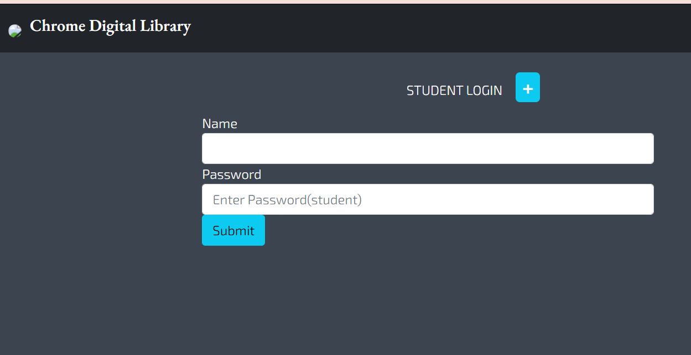
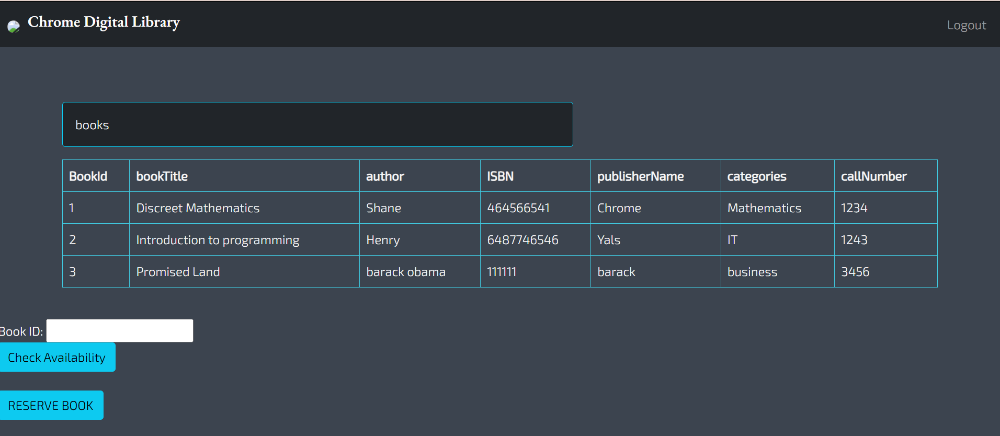
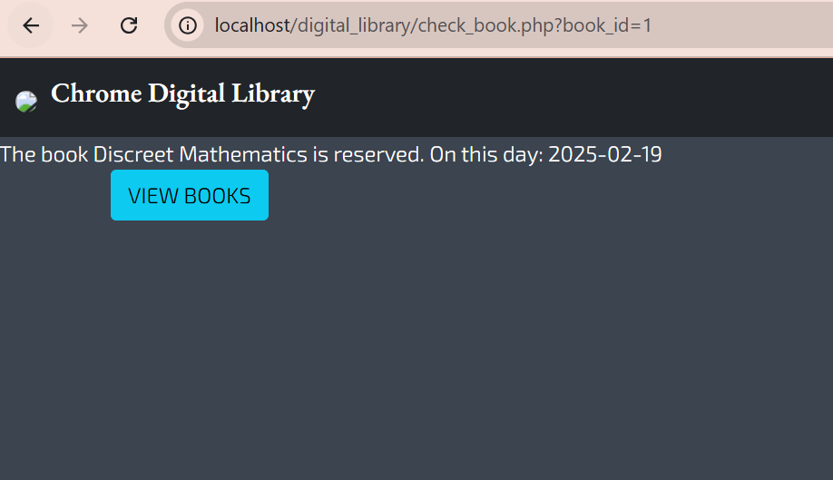
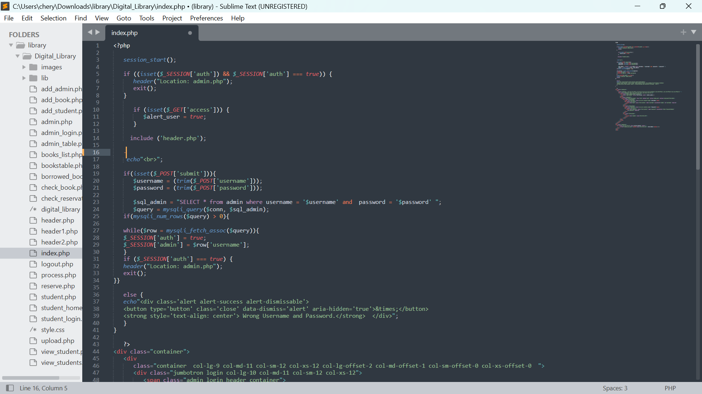
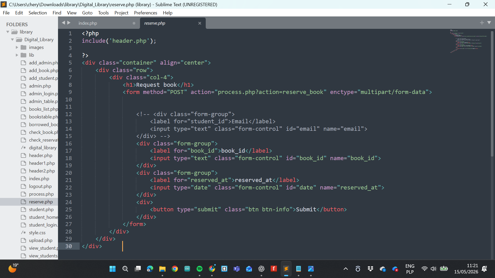
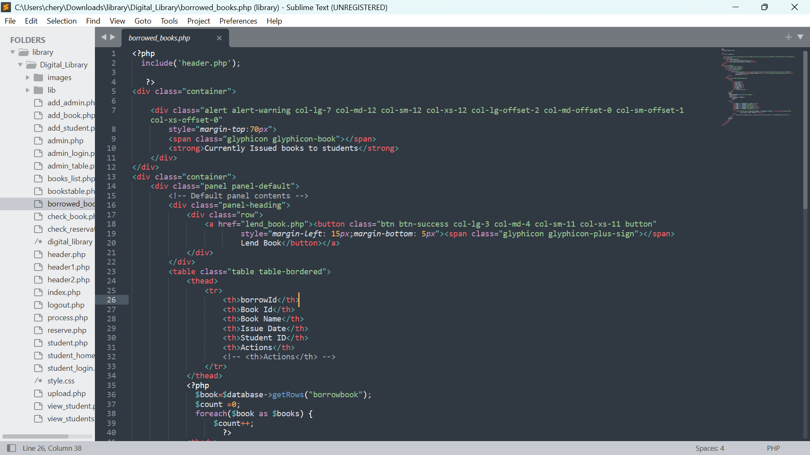
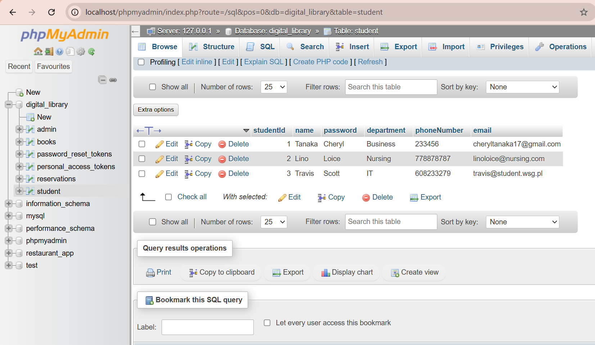
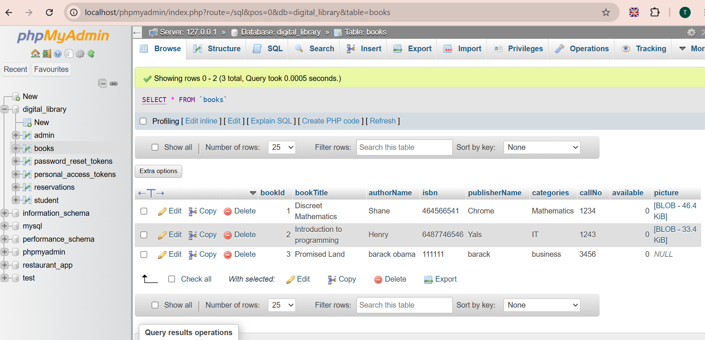
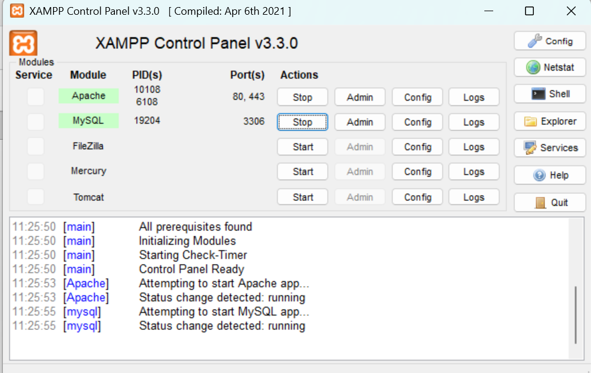

<h1>Digital Library Management System</h1>

<h2>Description</h2>
This project consists of a web-based digital library management system developed using PHP, MySQL, Bootstrap, and XAMPP. The application allows users to browse available books, check their availability status, and reserve books through an interactive and responsive interface. The system integrates a MySQL database managed through phpMyAdmin to handle book records, reservations, and user interactions. PHP is used to manage backend functionality and database communication, while Bootstrap provides a clean and responsive user experience across different devices.
<br />


<h2>Languages Used</h2>

- <b>PHP</b> 
- <b>HTML</b>
- <b>SQL</b> 

<h2>Utilities & Frameworks </h2>

- <b>Bootstrap</b> 
- <b>XAMPP</b> 
- <b>phpMyAdmin</b> 
- <b>MySQL</b> 
- <b>Apache Server</b> 
- <b>Sublime Text</b> 
  

<h1 align="center">📚 Library Management System</h1>

<p align="center">
A web-based Library Management System built using PHP, MySQL, and XAMPP.
</p>

---

<h2>🖥️ Frontend</h2>

<h3>Home Page</h3>
<p align="center">
Browse available books and navigate the system.<br/><br/>

</p>

<br/>

<h3>Book List / Catalog</h3>
<p align="center">
View all books available in the library.<br/><br/>

</p>

<br/>

<h3>Reservation Page</h3>
<p align="center">
Reserve books for borrowing.<br/><br/>

</p>

---

<h2>⚙️ Backend</h2>

<h3>index.php</h3>
<p align="center">
Main entry point of the system handling routing and dashboard loading.<br/><br/>

</p>

<br/>

<h3>reserve.php</h3>
<p align="center">
Handles book reservation logic and updates the database.<br/><br/>

</p>

<br/>

<h3>borrowed_books.php</h3>
<p align="center">
Displays all books currently borrowed by users.<br/><br/>

</p>

---

<h2>🗄️ Database</h2>

<h3>Database Tables</h3>
<p align="center">
Structure of the database including users, books, and reservations tables.<br/><br/>

</p>

<br/>

<h3>Book Records</h3>
<p align="center">
Sample data stored in the books table.<br/><br/>

</p>

---

<h2>🧰 Server</h2>

<h3>XAMPP Server</h3>
<p align="center">
Local development environment used to run the project (Apache + MySQL).<br/><br/>

</p>

---

<h2>🚀 How to Run</h2>

<ol>
  <li>Install XAMPP</li>
  <li>Place project folder inside <code>htdocs</code></li>
  <li>Start Apache and MySQL in XAMPP</li>
  <li>Import database into phpMyAdmin</li>
  <li>Run project in browser: <code>http://localhost/your-project-folder</code></li>
</ol>

---

<!--
```diff
- red text (errors)
+ green text (adds)
! orange text (warnings)
# gray text (notes)
@@ purple bold text (important)@@
